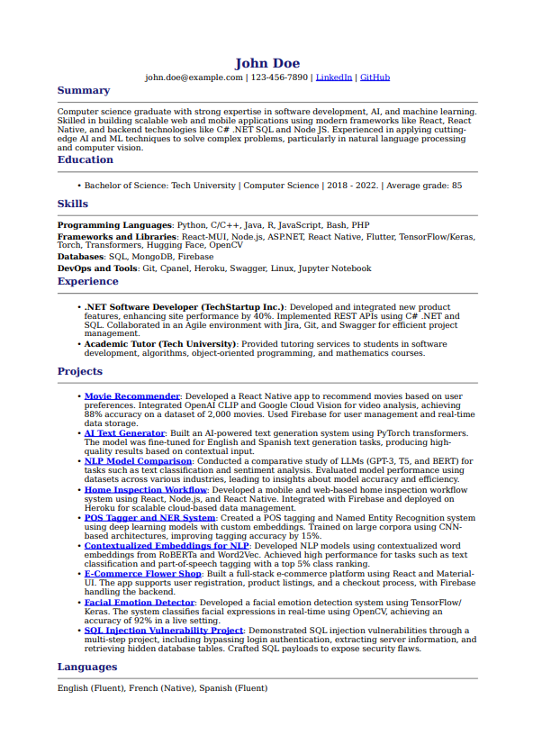

# Resume Builder - README

## Overview
This project provides a tool to automatically generate a professional resume in PDF format using Markdown as the intermediate format. The program allows users to input their resume data in a structured JSON format and generates a beautifully formatted resume PDF using an online Markdown-to-PDF converter.

### Key Features
- **JSON Input Format**: Users can input their resume data in a JSON file following a structured format.
- **LLM Integration**: Users can feed their existing resume into a large language model (LLM) and request the LLM to return it in the format required by this tool’s JSON file.
- **Markdown to PDF Conversion**: The tool converts the structured resume into a Markdown format, which is then converted to a PDF file with optimized formatting (smaller font sizes, tighter margins, and custom CSS styling).
- **Project-Friendly**: GitHub links are automatically included in the resume’s projects section, allowing quick access to the user’s portfolio.

## Workflow
### 1. Prepare Your JSON File
You need to prepare a `data.json` file that contains your resume data in a structured format. The format should follow this example:

```json
{
  "name": "John Doe",
  "contact": {
    "email": "john.doe@example.com",
    "phone": "123-456-7890",
    "linkedin": "https://linkedin.com/in/johndoe",
    "github": "https://github.com/johndoe"
  },
  "summary": "Software developer with experience in AI, machine learning, and backend systems.",
  "education": [
    {
      "level": "Bachelor of Science",
      "institution": "Tech University",
      "field": "Computer Science",
      "duration": "2015 - 2019",
      "score": "85"
    }
  ],
  "skills": {
    "Programming Languages": [
      "Python", 
      "Java", 
      "C++"
    ],
    "Frameworks and Libraries": [
      "TensorFlow", 
      "React", 
      "Node.js"
    ],
    "Databases": [
      "SQL", 
      "MongoDB"
    ],
    "DevOps and Tools": [
      "Git", 
      "Docker", 
      "Kubernetes"
    ]
  },
  "work_experience": [
    {
      "job_role": "Software Engineer",
      "company_name": "TechCorp",
      "description": "Worked on building scalable backend systems using Node.js and MongoDB.",
      "duration": "2019 - 2021"
    }
  ],
  "projects": [
    {
      "name": "AI Chatbot",
      "description": "Developed an AI-powered chatbot using TensorFlow and Python.",
      "github_link": "https://github.com/johndoe/ai-chatbot"
    }
  ],
  "languages": [
    "English (Fluent)", 
    "Spanish (Intermediate)"
  ]
}
```

### 2. Using a Language Model to Structure Your Resume
If you have an existing resume, you can use a large language model (LLM) to convert it into the required JSON structure. Simply feed your resume into the LLM with a prompt to transform it into the above JSON format.

For example:
```
"Please take this resume and convert it into a structured JSON format that matches this template: {...}"
```

The LLM will output your resume in the JSON format, which you can then use with this tool.

### 3. Generate Your PDF Resume
Once you have your JSON file ready, follow these steps to generate the PDF:

1. **Clone the repository** and ensure you have `requests` installed in your Python environment:
    ```bash
    pip install requests
    ```

2. **Place your JSON file** (for example `data.json`) in the same directory as the program.

3. **Run the script**:
    ```bash
    python resume_generator.py
    ```

4. The script will generate a **Markdown file** from your JSON data and then convert it to a **PDF file** (`Resume.pdf`) using an external Markdown-to-PDF API.

## Customizing Your PDF
The program uses the WeasyPrint engine and custom CSS to format the PDF. You can adjust the styles by modifying the `cssfile` variable in the script. This allows for flexibility in how your resume looks, including font sizes, colors, and margins.

### Example Customization:
```python
cssfile = """
          body {
              padding: 10px;
              margin: 10px;
              font-size: 10pt;
              line-height: 1.5;
          }
          h1 {
              font-size: 16pt;
              color: Navy;
          }
          h3 {
              font-size: 12pt;
              color: DarkSlateBlue;
          }
      """
```

## API Conversion
This project uses the [md-to-pdf](https://md-to-pdf.fly.dev) service to convert Markdown to PDF. You can switch the engine or endpoint if you prefer another conversion service.

## Example
Here is a sample workflow to generate a resume:

```python
# Load data from your JSON resume
resume_data = load_data_from_json('data.json')

# Generate markdown content from resume data
markdown_text = resume_data.generate_markdown()

# Convert the markdown to a PDF and save it as 'Resume.pdf'
convert_markdown_to_pdf(markdown_text)
```

### Output
The script will generate a `Resume.pdf` file with the data from your JSON file, including formatted sections for your personal info, education, work experience, skills, and projects.



## Conclusion
This tool provides an easy way to automate the process of generating a well-formatted resume. By feeding in structured JSON data, users can leverage this tool to quickly produce professional PDFs that are ready to share with employers.
